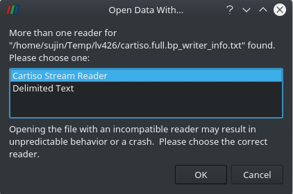
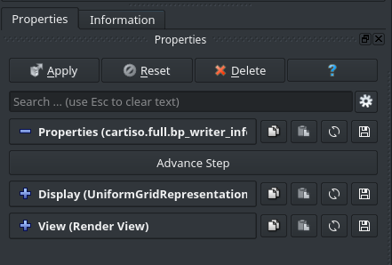

# In-Situ Visualization using ADIOS Staging

ADIOS is a parallel IO library for use in large scale simulations and
visualizations. It can be found [here](https://github.com/ornladios/ADIOS),
ADIOS supports staging writes and reads, where the data is not actually
written to the file system but rather stored in memory in a staging area.
This can be inside the address space of the writer process or a separate
staging process. Whether reads and writes are performed on a file system or
a staging area can be configured at runtime. Please refer to the
[user manual](https://www.olcf.ornl.gov/center-projects/adios/) for more
details about ADIOS. ADIOS' staging support can be used to perform in-situ
visualization. This plugin demonstrates how that can be done.


This plugin is implemented as a ParaView reader. Currently, it is implemented
to specifically read the data written by the "cartiso" mini-app, which is part
of a set of IO benchmarking mini-apps, MiniIO. A fork of the original
MiniIO repository, with some changes for our use case, can be found
[here](https://github.com/sujin-philip/miniIO). The cartiso mini-app generates
a time-series of uniform grid datasets with two point-data fields - value and
noise, and writes it to an ADIOS stream.


## Building the Software:

**ADIOS:** ADIOS’ staging support depends on some third party libraries.
There are a few different staging methods that are supported. We have chosen
*FlexPath* for our testing purposes. The procedure to download and build
FlexPath and ADIOS can be found in the ADIOS
[user manual](https://www.olcf.ornl.gov/center-projects/adios/).

**Cartiso:** We have provided a CMakeLists.txt file in the cartiso directory
of the repository. Cmake needs to find ADIOS for compiling Cartiso.
Set the `ADIOS_CONFIG` cmake variable to the “`adios_config`” executable built
by ADIOS. For our purposes, the cmake variable `ENABLE_ADIOS` should be `ON`,
whereas `ENABLE_HDF5`, `ENABLE_PVTI`, `ENABLE_PVTP` can be `OFF`.

**Plugin:** This plugin is part of ParaView. While configuring ParaView
build, set the `PARAVIEW_BUILD_PLUGIN_AdiosStagingReader` cmake variable
to `ON`. To automatically load the plugin with ParaView set
`PARAVIEW_AUTOLOAD_PLUGIN_AdiosStagingReader` to `ON`. You may also need
to set the `ADIOS_CONFIG` variable as mentioned for cartiso.


## Usage:

Though we are using FlexPath, support for other staging methods can be
implemented with minimal changes.

To run the simulation (cartiso) for this plugin use the following:
```
mpirun -np num_procs cartiso --tasks tx ty tz --size sx sy sz --adiosfull FLEXPATH --tsteps nt
```
where:
  num_procs = tx * ty * tz
  sx, sy, sz should be divisible by tx, ty, tz respectively
  nt > 1

When the simulation is run it writes a file
“`cartiso.full.bp_writer_info.txt`". This file has information for the
staging-reader on how to connect to the staging area.

To use this plugin:
1. Run an MPI job with pvserver and connect the ParaView client to it.
2. In the client, select File/Open and open the
`cartiso.full.bp_writer_info.txt` file.
3. Choose "Cartiso Stream Reader".

4. Hit Apply. The current time-step of the simulation will be shown.
5. To fetch the next available time-step, click the "Advance Step" button
in the properties panel.


Only one time-step can be accessed at a time. When advancing, all previous
steps are lost. When advancing past the last step a warning
("The stream has ended") will be displayed.


## Demo

We have run this plugin as a demo on "Cooley", which is an ALCF
(Argonne Leadership Computing Facility) machine. For simplicity, instead
of visualizing the data through a ParaView client, we implemented a
ParaView python script that reads each time-step from the simulation,
applies the contour filter on it (on the value field) and writes out the
resulting polydata. We ran 72 processes (6 nodes) of the simulation and 24
processes (2 nodes) of pvbatch.

The Python Script:
```python
from paraview.simple import *

stream = CartisoStream(StreamName="cartiso.full.bp")

contour = Contour(stream)
contour.ContourBy = ['POINTS', 'value']
contour.Isosurfaces = [0.68]

writer = CreateWriter("pvcontour.pvtp", contour)

step = -1
while True:
  stream.UpdatePipeline()
  tstep = int(stream.FieldData[0].GetRange()[0])

  if step < tstep:
    step = tstep
    print "Writing step:", step
    writer.FileName = "pvcontour" + str(step) + ".pvtp"
    writer.UpdatePipeline()

  if step < 49:
    stream.AdvanceStep()
  else:
    break
```

The Job Script for cooley:
```bash
#! /bin/sh

SIMULATION=cartiso
PVBATCH=pvbatch
PVSCRIPT=demoscript.py

cd ParaViewStaging

NODES=`cat $COBALT_NODEFILE | wc -l`
if [ $NODES -lt 8 ]; then
  echo "Error: need atleast 8 nodes"
  exit 1
fi

PV_NODES=$((NODES/4))
SIM_NODES=$((NODES - PV_NODES))

head -n $PV_NODES $COBALT_NODEFILE > pv_nodefile.txt
tail -n $SIM_NODES $COBALT_NODEFILE > sim_nodefile.txt

PV_PROCS=$((PV_NODES * 12))
SIM_PROCS=$((SIM_NODES * 12))

# make it larger along x-axis so that vtkExtentTranslator make y-z
# slabs
YZSIZE=$((SIM_NODES * 20))
XSIZE=$((PV_PROCS * YZSIZE))

mpirun -f sim_nodefile.txt -n $SIM_PROCS $SIMULATION --tasks $SIM_PROCS 1 1 --size $XSIZE $YZSIZE $YZSIZE --adiosfull FLEXPATH --tsteps 50 &

sleep 30s

mpirun -f pv_nodefile.txt -n $PV_PROCS $PVBATCH $PVSCRIPT

wait
```


## Challenges

Since ADIOS is an actively developed software, we had some issues with the
current version at the time of this writing. These issues have been reported
to the ADIOS authors and should be fixed in future versions.

The latest stable release 1.11.0 was crashing when using FlexPath.
The issue is fixed in the latest development branch (“master”), so that is
what we used.

We hit an issue in reading the data. This one seems to be a problem in
FlexPath as the reads were working fine for files. When reading with multiple
processes, the data is “off” by some factor. The reads seem to be correct only
in cases where the partitions in the readers are similar to the partitions of
the writer. For our demo, we partitioned the data in Y-Z slabs for both reader
and writer. This is the reason for the peculiar tasks decomposition
(`--tasks $SIM_PROCS 1 1`) and data size computation (`YZSIZE` and `XSIZE`)
in the above job-script.
